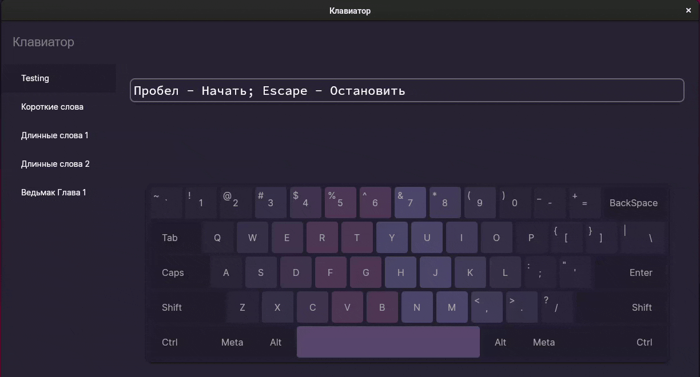

# Blindy

### A simple typing training app written in C#.

It was created as a school project and is not intended for any maintenance.

## Features

- **Custom exercises:** Add your own `.txt` files into `Data/Exercises/`
- **Custom keyboard layout:** Add your own `.json` files into `Data/Layouts`

## Demo



## Getting Started

### Prerequisites

To run Blindy you need:

- Dotnet Runtime (version = 7.0)

### 1. Clone the repository

```shell
git clone https://github.com/DevorCapitaux/Blindy.git
cd Blindy
```

### 2. Run

```shell
dotnet run
```
